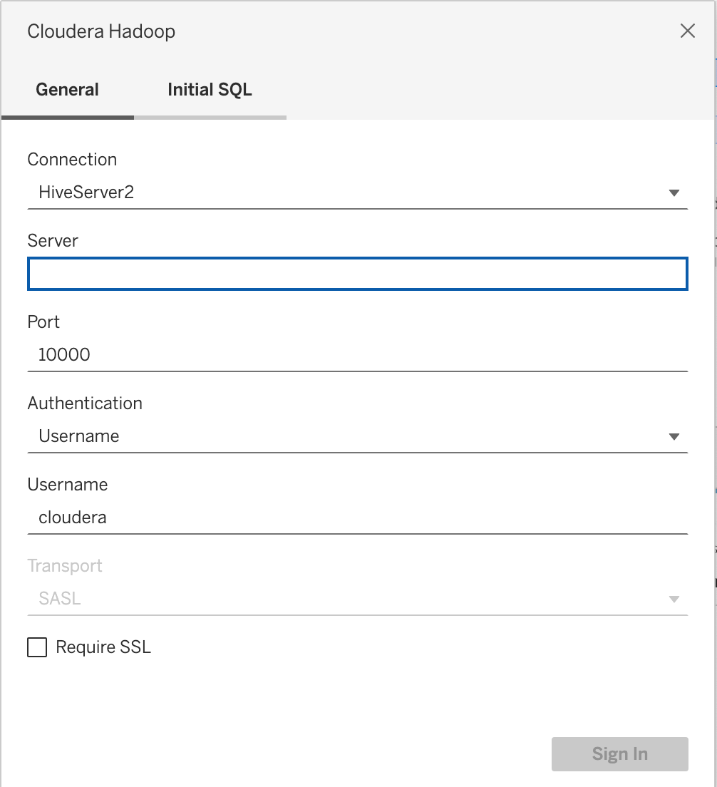

# BigData Course Sep-2024

**AWS_EMR:** AWS EMR + S3

**HBaseSparkSQL:** Spark-sql + HBase

**KafkaConsumer:**  Kafka Consumer + Spark Streaming API + HBase + 

**KafkaProducer:** Integrate with Finnhub API + listen topic + add stock object to topic

**Tableau:** Visualization using Tableau for data from Hive using view

**Presentation url:**
https://mum0-my.sharepoint.com/:p:/g/personal/mmostafa_miu_edu/EY2ie682y4lBtGOVIPl2T2MBB6uJ8tC-NBITsC4uJtfZEA?email=mmukadam%40miu.edu&e=ZXSCZ1

**Steps:**
### 1- Kafka
    **Download Kafka**: 

        - Go to the [Apache Kafka downloads page](https://kafka.apache.org/downloads) and copy the download link for the latest binary. 

 

    **Extract Kafka**: 

        - Download and extract Kafka in your home directory or a preferred location: 

  

     on bash (Terminal)

     wget https://archive.apache.org/dist/kafka/3.8.0/kafka_2.12-3.8.0.tgz --no-check-certificate 

     tar -xzf kafka_2.12-3.8.0.tgz 

     cd kafka_2.12-3.8.0 
### 2 - Zookeeper: if needed (skip as it should be already running)

   **Start Zookeeper**: 

     - Kafka requires Zookeeper to run. Start Zookeeper using the provided script: 

        on bash (Terminal)

        bin/zookeeper-server-start.sh config/zookeeper.properties  

### 3 - Create Topic

 

  #### Create a Topic and Test 

  

    **Create a Topic**: 

     - In a new terminal, create a Kafka topic: 

  

     on bash (Terminal)

       bin/kafka-topics.sh --create --topic stock_prices --bootstrap-server localhost:9092 --partitions 1 --replication-factor 1 

### 4 - Start Kafka service
     bin/kafka-server-start.sh config/server.properties

### 5 - Start Producer project as jar
     java -jar target/KafkaFinnhubProducer-1.0-SNAPSHOT.jar

### 6 - Submit Consumer project as jar or run from the eclipse

### 7 - Make sure sql view is created in Hive foor Tableau

      create view vm_stock_statistics2 AS
        select rowkey, cast(totalPrice as double), cast(totalVolume as double), timeStamp from hbase_stock_statistics ;

### 8 - Refresh in Tableau project based on the connected IP (VM IP) to get latest view data using project "TableauBin.twb"
      
      
      
      
      

      
     
### 9 - Check results in Tableau

### Additional Configuration 

- **Edit Config Files**: 

  - You might need to edit `config/server.properties` and `config/zookeeper.properties` to adjust settings like `broker.id`, `log.dirs`, and `zookeeper.connect`. 

  

     
